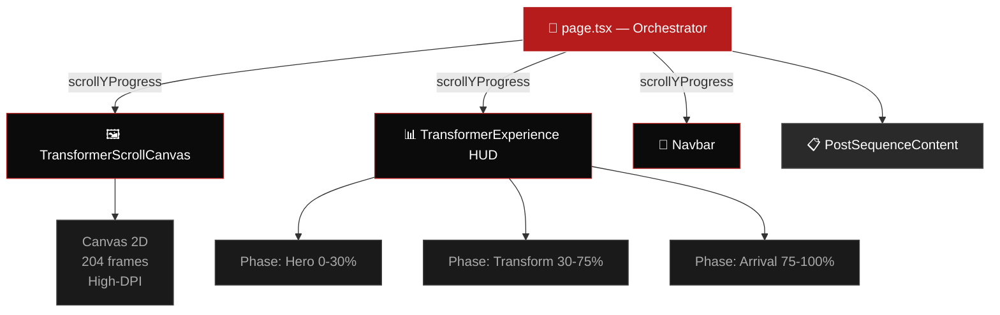

<div align="center">

<!-- Animated SVG Header -->


<br/>

<!-- Animated typing effect -->
<a href="https://git.io/typing-svg"></a>

<br/><br/>

<!-- Badges -->


<br/><br/>

<!-- Animated line -->


</div>

<br/>

## 🎬 Overview

> A single-scroll landing page where the hero image **seamlessly morphs** from a static truck into a heroic robot — **204 frames** rendered on a high-DPI canvas, synchronized to scroll progress. The background crossfades from a dark garage to a cinematic battlefield.

<div align="center">

```
    🚛  ━━━━━━━━━━━━━━━━━━━━━━━━━━━━━━━━━━━━━━━  🤖
    TRUCK                SCROLL →               ROBOT
    Frame 001          Frame 102            Frame 204
    ┃ Garage ┃      ┃ Transforming ┃    ┃ Battlefield ┃
```

</div>

<br/>

<!-- Animated line -->


## ✨ Features

<table>
<tr>
<td width="50%">

### 🎯 Scroll-Driven Animation
Every pixel of scroll maps directly to a frame, giving **full user control** over the transformation timeline.

### 🔧 Mechanical Fidelity
Panels split, rotate, slide, and fold with visible hinges, pistons, and interlocking metal components.

### 🌄 Cinematic Environment
Background evolves from a dark industrial garage to a vast outdoor battlefield **in perfect sync**.

</td>
<td width="50%">

### 🖥️ High-DPI Rendering
Canvas scaled by `devicePixelRatio` — razor-sharp on **Retina & 4K** displays.

### ⚡ Performance Optimized
Frames preloaded progressively. Lightweight HUD overlays won't block paint or scroll.

### ♿ Accessibility First
Screen-reader summaries, reduced-motion fallback, and keyboard-navigable CTAs included.

</td>
</tr>
</table>

<br/>

## 🏗️ Architecture



> **Key principle:** A single `useScroll` in `page.tsx` owns `scrollYProgress`. Every child reads from it — **zero competing scroll listeners**.

<br/>

## 📂 Project Structure

```
transformer-site/
├── app/
│   ├── layout.tsx              ← Orbitron + Rajdhani fonts
│   ├── globals.css             ← Tailwind v4 + design tokens
│   └── page.tsx                ← 🎯 Orchestrator (single scroll source)
├── components/
│   ├── Navbar.tsx              ← Glassmorphism fixed nav
│   ├── TransformerScrollCanvas.tsx  ← 🖼️ Canvas 2D frame renderer
│   ├── TransformerExperience.tsx    ← 📊 HUD overlay (3 phases)
│   └── PostSequenceContent.tsx      ← Specs + Features + Footer
├── data/
│   └── transformerData.ts      ← HUD copy, specs, features
├── public/
│   └── images/
│       └── transformer-sequence/
│           ├── 1.jpg           ← Frame 001
│           ├── 2.jpg           ← Frame 002
│           ├── ...
│           └── 204.jpg         ← Frame 204
├── scripts/
│   └── generate-placeholder-frames.mjs
├── vercel.json
├── next.config.ts
├── tailwind.config.ts
└── tsconfig.json
```

<br/>

## 🎨 Design Tokens

| Token | Value | Usage |
|:---:|:---:|:---|
| `--base-dark` | `#0b0b0b` | Page background, canvas BG |
| `--accent-metal` | `#B71C1C` | Deep red accents (minimal use) |
| `--neutral-carbon` | `#2a2a2a` | Card borders, subtle surfaces |
| **Orbitron** | Headings | Futuristic, mechanical feel |
| **Rajdhani** | Body / UI | Clean, technical readability |

<br/>

## 🚀 Quick Start

```bash
# 1. Clone the repository
git clone https://github.com/sonu93418/Transformer.git
cd Transformer/transformer-site

# 2. Install dependencies
npm install

# 3. Add your frames (1.jpg … 204.jpg)
#    Place them in: public/images/transformer-sequence/

# 4. Start development server
npm run dev
```

Then open **http://localhost:3000** and scroll!

<br/>

## 🖼️ Adding Your Frames

### Option A: Real frames from video
1. Generate your transformation video using **VEO 3** (Google Flow)
2. Convert to frames using **EZGIF** → Video to JPG (20-30 FPS)
3. Rename files to `1.jpg`, `2.jpg`, … `204.jpg`
4. Place in `public/images/transformer-sequence/`

### Option B: Placeholder frames for testing
```bash
# Install canvas dependency
npm install canvas --save-dev

# Generate 204 colored placeholder frames
node scripts/generate-placeholder-frames.mjs
```

<br/>

## 🌐 Deploy to Vercel

```bash
# Option 1: Via Vercel CLI
npm i -g vercel
vercel

# Option 2: Via GitHub
# → Push to GitHub → Connect repo on vercel.com → Auto-deploy
```

The included `vercel.json` sets **immutable caching** on frame images for maximum performance.

<br/>

## 📊 Scroll Phases

```
 Scroll Progress    Phase              HUD Content
 ──────────────    ──────             ────────────
   0% ─── 30%      🚛 HERO           "TRANSFORMATION SEQUENCE"
                    Presence           System standby readout

  30% ─── 75%      ⚙️ TRANSFORM       "SYSTEM: SHIFTING"
                    Peak action        Diagnostics + frame counter

  75% ─── 100%     🤖 ARRIVAL         "TRANSFORMATION COMPLETE"
                    Robot reveal       Signature + CTA
```

<br/>

## 🛠️ Troubleshooting

<details>
<summary><b>🔴 Animation looks broken</b></summary>
<br/>
Truck and robot angles don't match, or lighting/scale is off.

**Fix:** Use source images with the same perspective, crop, and scale.
</details>

<details>
<summary><b>🔴 Scroll animation lagging</b></summary>
<br/>
Frames too large or loading late.

**Fix:** Use WebP format, compress images, preload the first batch, and lazy-load the rest. Reduce frame count for mobile.
</details>

<details>
<summary><b>🔴 Grainy / blurry canvas</b></summary>
<br/>
Canvas not scaling for high-DPI screens.

**Fix:** Already handled — `TransformerScrollCanvas` scales by `window.devicePixelRatio`. Ensure you're using high-res source frames.
</details>

<details>
<summary><b>🔴 Images not loading after deploy</b></summary>
<br/>
Incorrect path reference.

**Fix:** Frames must be in `/public/images/transformer-sequence/` and named `1.jpg` through `204.jpg`.
</details>

<details>
<summary><b>🔴 Mobile performance issues</b></summary>
<br/>
High-resolution frames on low-powered devices.

**Fix:** Serve smaller images and fewer frames for mobile via responsive loading.
</details>

<br/>

## 🧰 Tech Stack

<div align="center">


</div>

| Technology | Purpose |
|:---|:---|
| **Next.js 14+** | App Router, static export, optimized builds |
| **TypeScript** | Type safety across all components |
| **Tailwind CSS v4** | Utility-first styling with theme variables |
| **Framer Motion** | Scroll-linked opacity, translate, phase transitions |
| **Canvas 2D API** | High-performance frame-by-frame rendering |
| **Vercel** | Edge deployment with immutable asset caching |

<br/>

<!-- Animated line -->


<div align="center">

### 🤝 Support

If you enjoy this project and want to support it:

<a href="https://buymeacoffee.com/karan01"></a>

<br/><br/>

Made with ❤️ and a lot of scroll events

<br/>

<!-- Animated footer -->


</div>